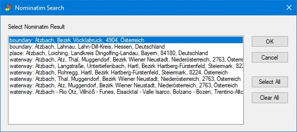
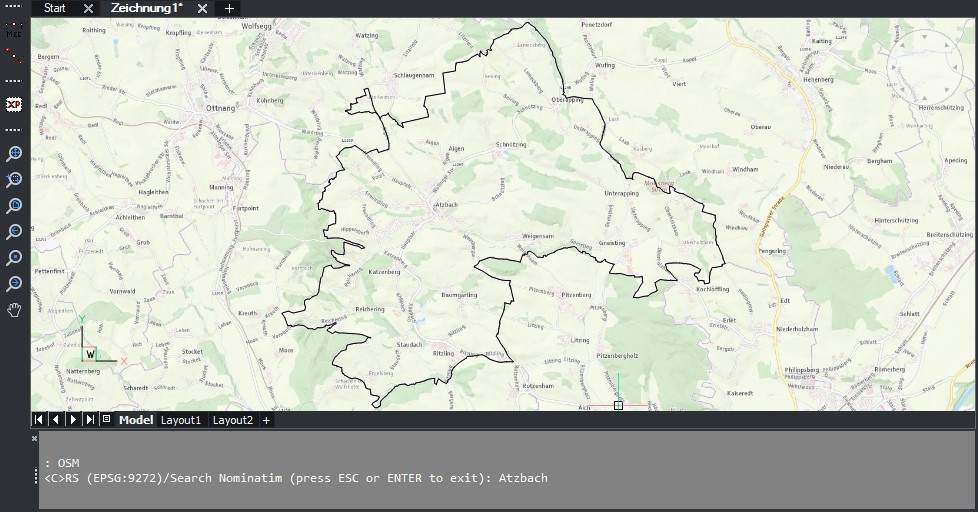

# OSM_NOMINATIM.LSP (command OSM)

This is an AutoLISP routine that uses the [OpenStreetMap Nominatim Search API](https://nominatim.org/release-docs/latest/api/Search/) to search for locations in OpenStreetMap.
It is based on the [Nominator Locator Filter](https://github.com/rduivenvoorde/nominatim_locator_filter) Plugin for QGIS.
It utilizes [DuckDB](https://duckdb.org/) and [DuckDB Spatial](https://duckdb.org/docs/extensions/spatial/overview.html) to send queries to the global Nominatim search service and to convert and transform the resulting geometries.

## Installation of required Tools
To run the command `OSM` we must download [duckdb.exe](https://duckdb.org/docs/installation/?version=stable&environment=cli&platform=win&download_method=direct&architecture=x86_64) and set the gloabl AutoLISP variable `*DUCKDB*` in `osm_nominatim.lsp` to the full path of `duckdb.exe`.
Instead of changing `*DUCKDB*`, we can place `osm_nominatim.lsp` in the Windows search path.

If we like to use `OSM` in AutoCAD, we need to download [ICONV.EXE](https://en.wikipedia.org/wiki/Iconv) as well.
There is no need for this in BricsCAD/Lite.

## How to use the command "OSM"?
By entering `OSM` in the command line, we can search for worldwide locations (i.e. places, addresses, streets, countries,...) in OpenStreetMap.

`<C>RS (EPSG:9273)/Search Nominatim (use "&" to search in current extents, press ESC or ENTER to exit): Vienna`

The command has one option:

|         |         |
| ------- | ------- |
| <**C**>RS | sets the current coordinate reference system (defined as EPSG code) |

If we enter a search term (i.e. Atzbach), `OSM` sends the query to the global Nominatim search service and shows the results in a dialog window.

After we select one or more results in the dialog box and press the OK button, `OSM` loads the geometries into Model Space and zooms to the extents of the loaded entities.
The resulting geometries are automatically transformed to the selected target CRS.

If the result consists of points, OSM inserts the `osm_point` block for each point instead of using `POINT` entities.

> [!TIP]
> To do a local search (so only within current windows extent), we need to put & in front of the search term (i.e. "&Gmund"). We can even add a country code to the search term to ONLY search that country (i.e. "Gmund at")

## Credit

Credit goes to *Alan J. Thomson* (I used his List Select Dialog code), to *Richard Duivenvoorde* (for his idea with the Nominatim Locator Filter for QGIS), to the makers of `DuckDB` and to *Evan Rouault* (master of `GDAL`).